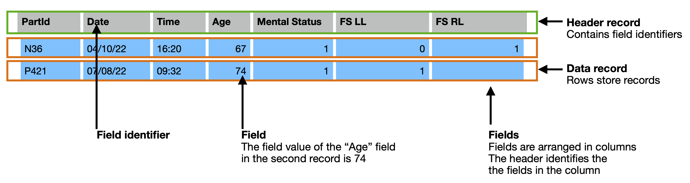

# RADx Data Dictionary Specification

## Introduction

A data dictionary is a form of _metadata_ that describes _data_.  No matter what the concrete serialization format may be, we assume that data is essentially a list of _records_ that contain _fields_.  A field comprises a _field identifier_ and a _field value_.   

When data is stored in a tabular Comma Separated Values (CSV) file format, records are stored in _rows_, and fields are stored as cells within the rows.   The first row typically represents a _header record_ that contains field identifiers.  For a given column, the field identifier in the header record essentially "names" the fields that are contained within that column.

The table below shows an example CSV file that contains some data.  The data contains two records (orange boxes) made up of seven fields (blue boxes).   In this example, the field identifiers are:  `PartId`, `Date`, `Time`, `Age`, `Mental Status`, `FS LL`, and `FS RL`.  Thus, the 4th column contains `Age` fields.  In the first record (second row) the `Age` field has a field value of `67`.  In the second record (third row), the `FS RL` field value does not have a value and we say that this field is _blank_.

All RADx datafiles SHOULD have header records.



## RADx Data Dictionaries

A RADx _data dictionary_ is a Comma Separated Values (CSV) file that describes how RADx _data_ contained in another CSV file, a _datafile_, is structured.  A data dictionary CSV file contains EXACTLY ONE data dictionary.

## Data Dictionary CSV Format

Data dictionaries MUST use the CSV format specified by [RFC 4180](https://datatracker.ietf.org/doc/html/rfc4180#page-2).  

Data dictionaries may be created with tools such as Google Sheets or Microsoft Excel.  Both of these tools produce CSV files in accordance with this specification.  When saving a CSV file in Microsoft Excel be sure to choose the "CSV UTF-8 (Comma delimited) (.CSV)" file format.

## Data Dictionary Layout

A data dictionary contains a list of records (known as _Data Elements_ in RADx terminology), represented as rows, that describe the sequence of fields in a target datafile.  There is exactly one data dictionary record per datafile field. 

A data dictionary CSV file contains a header record plus _one record for each of the target datafile's fields_.  Since the target datafile's fields are in columns, this means a record in a data dictionary essentially describes a column in the target data file.  Thus, if the target datafile has five columns in it, the data dictionary will contain _six_ records – one header record plus five non-header records that describe the five datafile fields.

 Each data dictionary record describes the particular features, or attributes, of the target datafile field that it represents.  For example, taking the `PartId` field in the above datafile, the data dictionary would describe this field as having an identifier of `PartId`, having field-values that have a datatype of `string` and a pattern of `^[NP](\d+)$`, and requiring a non-blank value.

Each record in a data dictionary has the same number of fields.  In other words, each record has the same length, or each row the same number of columns.
 
### Data Dictionary Row Ordering

The ordering of records in a data dictionary is SIGNIFICANT.  The sequence of records in a data dictionary MUST correspond to the sequence of fields in the target datafile.  Thus, the first non-header record in a data dictionary file describes the first field in the target datafile, the second non-header record in a data dictionary describes the second field in a datafile, and so on. 

While the Id of a data dictionary record SHOULD match the target datafile Field Id, it is the sequence order of data dictionary records that is matched to the sequence order of data file fields.

### Data Dictionary Fields

A data dictionary header record contains the following sequence of strings as its field identifiers:

[Id](#field-id), [Label](#field-label), [Section](#field-section), [Cardinality](#field-multivalued), [Terms](#field-terms), [Datatype](#field-datatype), [Pattern](#field-pattern), [Unit](#field-unit), [Enumeration](#field-enumeration), [Missing Value Codes](#field-missing-value-codes), [Notes](#field-notes).

These data dictionary columns are described in more detail below. 

Since columns are identified by column headers the ordering of these columns is not significant.  However, for maximum interoperability and ease of use, we strongly recommend following the ordering specified here.  

If necessary, subsequent fields/columns may be appended to a data dictionary to support the preservation of extra information that is not provided for by the columns here.

## Data Dictionary Fields Specification

Each record in a data dictionary MUST contain the following, possibly empty, fields.  For each field, the *Value Status* specifies whether a non-blank value is required or whether a blank value is acceptable.

### Field: Id

__Value Status__: REQUIRED (the value for the `Id` field MUST NOT be empty)

The `Id` field in the data dictionary specifies an identifier for the datafile field being described.  Datafile field identifiers are strings.  To cater for pre-existing RADx study data we do not impose any restrictions on the format or characters that make up a field identifier.  Field identifiers may contain spaces.

### Field: Label

__Value Status__: REQUIRED (the value MUST NOT be empty)

The `Label` field in the data dictionary specifies a presentation label for the datafile field being described.  Labels are strings; they may be a human readable form of the [Id](#field-id).   In the case where data represents the response to survery questions, the label is often the text of the question that was asked.

### Field: Section

__Value Status__: OPTIONAL

The `Section` field in the data dictionary specifies a section, or group name, for each entry.  Section names may be used for organizing or clarifying purposes and are optional. 

### Field: Terms

__Value Status__: OPTIONAL

The `Terms` field in the data dictionary specifies a list of ontology terms that describe key concepts in the meaning of the field being described.  Multiple terms (separated by white spaces (0x0020 or 0x00A0) or newline characters (0x000A) with appropriate escaping) may be specified but terms should be as specific as possible.  Terms may be drawn from any published ontology.  The identifiers for terms MUST be fully qualified Internationalized Resource Identifiers (IRIs), for example, [http://purl.bioontology.org/ontology/MESH/D004906](http://purl.bioontology.org/ontology/MESH/D004906).  While not required, we strongly recommend that term identifiers are resolvable.

This field is optional but we strongly encourage its use in order to make data more easily searchable.  

### Field: Cardinality

__Value Status__: OPTIONAL (default value is `false`).

The `Cardinality` field in the data dictionary specifies whether a field is expected to be single valued or muti-valued in a datafile. Multiple values in datafile field MUST be separated with a pipe character, without surrounding white space.  Acceptable values for the cardinality field in the data dictionary are either `single` (the associated datafile field has at most a single value) or `multiple` (the associated datafile field may have multiple values). If no value is specified then the default value of `single` is assumed.

As an example, consider a "symptoms" field which can accept multiple values within a single datafile field and thus has a cardinality of `multiple`. The data file for such a field may look like this:

|participantId|symptoms|
|--|--|
p1|cough
p2|cough \| sorethroat \| headache
p3|cough \| headache

### Field: Datatype

__Value Status__: REQUIRED (the value MUST NOT be empty)

The `Datatype` field in the data dictionary specifies a datatype name that types field values.  Datatype names MUST be from the set of allowable datatype names.  This set is defined as the set of [XML schema datatype](https://www.w3.org/TR/xmlschema-2/) names extended with a few datatype names, defined below, that cover US date formats (that are present in RADx data).  We use XML Schema Datatypes because this set of datatypes has precisely defined syntax and semantics.

If an enumeration is supplied to provide a list of controlled values, then the datatype name should be set as the datatype name of the values in the enumeration.  See the description of [Column: Enumeration](#field-enumeration).  For example, if an enumeration of `0 = Blood | 1 = Saliva` was specified for a field the datatype name for this field would be `integer`, since the values of this enumeration are integers.  Similarly, if an enumeration of `RBC = Red Blood Cells | WBC = White Blood Cells` is specified for a field then the datatype name for that field would be `string`, since the values of this enumeration are strings.

Datatype names MUST be all lowercase, thus `integer` rather than `Integer`.

#### Field Datatype Names

The following are the most common XML schema datatype names.  For each datatype name we provide a brief description of the valid lexical form for the datatype.  For more precise details follow the relevant datatype link to the XML schema datatypes specification.  

| Datatype Name | Brief Description |
| -- | -- |
[integer](https://www.w3.org/TR/xmlschema-2/#integer) | integer has a lexical representation consisting of a finite-length sequence of decimal digits (#x30-#x39) with an optional leading sign. If the sign is omitted, "+" is assumed. For example: -1, 0, 12678967543233, +100000.
[float](https://www.w3.org/TR/xmlschema-2/#float) | float values have a lexical representation consisting of a mantissa followed, optionally, by the character "E" or "e", followed by an exponent. The exponent must be an integer. The mantissa must be a decimal number. If the "E" or "e" and the following exponent are omitted, an exponent value of 0 is assumed. The special values positive and negative infinity and not-a-number have lexical representations INF, -INF and NaN, respectively. Lexical representations for zero may take a positive or negative sign.  For example, -1E4, 1267.43233E12, 12.78e-2, 12 , -0, 0 and INF are all legal literals for float.
[double](https://www.w3.org/TR/xmlschema-2/#double) | double values have a lexical representaton that is the same as float.
[boolean](https://www.w3.org/TR/xmlschema-2/#boolean) | boolean values can have the following legal literals, true, false, 1, 0
[string](https://www.w3.org/TR/xmlschema-2/#string) | string values are finite sequences of characters; this is the datatype to use if none of the other datatypes are appropriate.
[decimal](https://www.w3.org/TR/xmlschema-2/#decimal) | decimal has a lexical representation consisting of a finite-length sequence of decimal digits (#x30-#x39) separated by a period as a decimal indicator. An optional leading sign is allowed. If the sign is omitted, "+" is assumed. Leading and trailing zeroes are optional. If the fractional part is zero, the period and following zero(es) can be omitted. For example: -1.23, 12678967.543233, +100000.00, 210.
[dateTime](https://www.w3.org/TR/xmlschema-2/#dateTime) | dateTime has a lexical representation that consists of finite-length sequences of characters of the form: `'-'? yyyy '-' mm '-' dd 'T' hh ':' mm ':' ss ('.' s+)? (zzzzzz)?`.  For example, 2002-10-10T12:00:00-05:00 (noon on 10 October 2002, Central Daylight Savings Time or Eastern Standard Time in the U.S.) is 2002-10-10T17:00:00Z, five hours later than 2002-10-10T12:00:00Z.
[date](https://www.w3.org/TR/xmlschema-2/#date) | The lexical space of date consists of finite-length sequences of characters of the form: `'-'? yyyy '-' mm '-' dd zzzzzz?`.  
[time](https://www.w3.org/TR/xmlschema-2/#time) | The lexical representation for time is the left truncated lexical representation for dateTime: `hh:mm:ss.sss` with optional following time zone indicator. For example, to indicate 1:20 pm for Eastern Standard Time which is 5 hours behind Coordinated Universal Time (UTC), one would write: 13:20:00-05:00.

The set of allowable datatype names also includes the following.  These map to well-defined XML schema datatypes as follows:

| Datatype Name | Lexical Format | Comments | XML Schema Datatype Name | Lexical Format |
| -- | -- | -- | -- | -- |
date_mdy | mm/dd/yyyy | US-formatted date with slashes | date | yyyy-mm-dd
date_dmy | dd/mm/yyy  | International-formatted date with slashes | date | yyyy-mm-dd
timestamp | `[0-9]+` | A long integer number that represents a Unix timestamp | long | `[0-9]+` 

### Field: Pattern

__Value Status__: OPTIONAL

The `Pattern` field in the data dictionary may contain a regular expression that specifies a pattern that must be matched by datafile values.  For a given datafile value, the complete value must match the pattern.

### Field: Unit

__Value Status__: OPTIONAL

The `Unit` field in the data dictionary may be used to document the units for datafile values that represent quantities.

Since there is no standardized list of units used for RADx studies we do not provide a controlled list of units here.  However, here are some common units that we have observed being used in RADx data dictionaries.

| Unit name | Symbol | Dimension |
| -- | -- | -- |
millimeter | mm | [length](https://www.nist.gov/pml/owm/si-units-length)
meter | m | [length](https://www.nist.gov/pml/owm/si-units-length)
inch | in | [length](https://www.nist.gov/pml/owm/si-units-length)
foot | ft | [length](https://www.nist.gov/pml/owm/si-units-length)
liter | L | [volume](https://www.nist.gov/pml/owm/si-units-volume)
milliliter | mL | [volume](https://www.nist.gov/pml/owm/si-units-volume)
second | s | [time](https://www.nist.gov/pml/owm/si-units-time)
hour | h | [time](https://www.nist.gov/pml/owm/si-units-time)
day | d | [time](https://www.nist.gov/pml/owm/si-units-time)
week | w | [time](https://www.nist.gov/pml/owm/si-units-time)
degrees Celcius | °C | [temperature](https://www.nist.gov/pml/owm/si-units-temperature)
Fahrenheit | °F | [temperature](https://www.nist.gov/pml/owm/si-units-temperature)
kelvin | K | [temperature](https://www.nist.gov/pml/owm/si-units-temperature)
milligram | mg | [mass](https://www.nist.gov/pml/owm/si-units-mass)
gram | g | [mass](https://www.nist.gov/pml/owm/si-units-mass)
kilogram | kg |[mass](https://www.nist.gov/pml/owm/si-units-mass)
pound | lb | [mass](https://www.nist.gov/pml/owm/si-units-mass)
mole | mol | [amount of substance](https://www.nist.gov/pml/owm/si-units-amount-substance)
ampere | A | [electric current](https://www.nist.gov/pml/owm/si-units-electric-current)
moles per liter | mol/L | concentration

We recommend that, where possible, SI unit names are used and that the [NIST guidelines for printing and using units](https://www.nist.gov/pml/special-publication-811/nist-guide-si-chapter-6-rules-and-style-conventions-printing-and-using) is used.  In particular, unit symbols are printed in lower-case letters except that (a) the symbol or the first letter of the symbol is an upper-case letter when the name of the unit is derived from the name of a person; and (b) the recommended symbol for the liter in the United States is L.

### Field: Enumeration

__Value Status__: OPTIONAL

The `Enumeration` field in the data dictionary specifies a controlled list of values that datafile values must be drawn from.  In its most basic form, the list is specified as `"value0"=[label0] | "value1"=[label1] | ... | "valueN"=[labelN]`. Each item in the list is a value-label pair, written in the format`"value"=[label]`, and separated from surrounding items by a pipe character (`|`).  The value portion of the pair is surrounded by double quotes characters (`"`).  The label portion of the pair is surrounded by square brackets (`[` and `]`).

White space surrounding the pipe (`|`) and equals (`=`) characters is not significant.  Thus, the following are valid examples and are equivalent: 

`"0"=[Saliva] | "1"=[Blood]`

`"0"=[Saliva]|"1"=[Blood]`

`"0" = [Saliva] | "1" = [Blood]`

The above examples use integers as the values but values may be other datatypes: numbers, strings, dateTimes, etc.  For example, 

`"Saliva"=[Saliva] | "Blood"=[Blood]` (Values and labels are the same string)

`"RBC" = [Red Blood Cells] | "WBC" = [White Blood Cells]` (Values are an abbreviation of or a code for the string).

Note that the target datafile would contain the unqouted form of the quoted `value` part of the pairs.  For example, `RBC`, `WBC`, `0`, `1` etc.

#### Semantics of Enumeration Values

Each value in the list may have an ontology term IRI attached to it that specifies the precise meaning of the value.  Terms may be drawn from any published ontology.  The identifiers for terms MUST be fully qualified Internationalized Resource Identifiers (IRIs).  While not required, we strongly recommend that term identifiers are resolvable.

To attach terms to values the following syntax, with square and round brackets (inspired by Markdown) is used:

`"value" = [label](TermIRI) | ...`

For example,

`"0"=[Saliva](http://purl.obolibrary.org/obo/UBERON_0001836) | "1"=[Blood](http://purl.obolibrary.org/obo/UBERON_0000178)`

Labels are as before, surrounded in square brackets, and term IRIs for the labels immediately follow surrounded by round brackets.

The following is an extended BNF that specifies a grammar for enumerations.  White space surrounding terminals is not significant.

```ebnf
enumeration =  enumerationValuePair {'|' enumerationValuePair } ;

enumerationValuePair = value '=' label [ bracketedIri ] ;

value = quotedString ;

label = boxedString ;

bracketedIri = "(" fullIri ")" ;

fullIri = ? an IRI as defined in [RFC3987] ?

boxedString = ? A finite sequence of letters or numbers surrounded by [ and ] ?

quotedString = ? A finite sequence of letters or numbers surrounded by double quotation marks " ?

```

#### Converting from REDCap Choices format

The online survey software [REDCap](https://www.project-redcap.org) has a syntax that supports choices for questions.  The syntax we use here is a more precisely specified while also being more general.  In particular, we support embedding semantic identifiers for choices where as REDCap syntax does not.  In addition to this, it is possible to produce choices using the REDCap software that cannot be round tripped using REDCap choices syntax (a REDCap data dictionary can be exported that cannot be reimported by REDCap).

Given a string that represents a list of choices in the REDCap choices format, the following regular expression and regular expression replacement can be used to convert the string into a RADx Enumeration format.

Match,

```regex
((\p{L}|\p{N})(\p{L}| \p{L}|\p{N}| \p{N})*)\s*,\s*((\p{L}|\p{N})(\p{L}| \p{L}|\p{N}| \p{N})*) /gu
```

Replace with,

```regex
"$1$=[$4]
```

### Field: Missing Value Codes

__Value Status__: OPTIONAL

The `Missing Value Codes` field specifies, as an enumeration in the same format as the `Enumeration` field, codes that signify the reasons as to missing data values in _transformcopy_ data files.  

The standard set of codes, and default value for this field in the data dictionary if the values are blank, is shown below.

#### Standard Codes (Default value):

`"-9999"=[Reason Unknown] | "-9980"=[Not Sent to Data Hub] | "-9981"=[Data Transfer Agreement] | "-9982"=[No Participant Consent To Share] | "-9983"=[Not Available Or Mappable] | "-9984"=[Data Lost Or Inaccessible] | "-9985"=[Data Invalid] | "-9986"=[Anonymization Or Privacy Concerns] | "-9987"=[Other Unsent Reason Not Specified] | "-9960"=[Not Entered By Originator] | "-9961"=[Omitted This Value] | "-9962"=[Originator Chose to Omit] | "-9963"=[Question Not Applicable] | "-9964"=[Answer Not Known] | "-9965"=[Record Not Provided] | "-9966"=[All Originators Omitted Element] | "-9967"=[CDE Omitted With Exception] | "-9968"=[Other Unentered Reason Not Specified] | "-9940"=[Not Presented To Participant] | "-9941"=[Skip Logic] | "-9942"=[No Participant Consent to Ask] | "-9943"=[CDE Not Presented Due to Exception] | "-9944"=[Element Never Presented for Collection] | "-9945"=[Process Error] | "-9946"=[Other Unpresented Reason Not Specified]`.


### Field: Notes

__Value Status__: OPTIONAL

The `Notes` field in the data description may be used to store annotations, notes, comments on the row in the data dictionary and the corresponding field in the datafile.  The values of this field are for human use and are not parsed to be used in a computational way.

## Template

While the format of a published RADx Data Dictionary MUST be CSV, tools like Google Sheets or Excel can be used for editing/producing the CSV file.  A Google Sheet template data dictionary may be found [here](https://docs.google.com/spreadsheets/d/1f5KcnCx7fEHcC8uSS5CB71-D-y51BDxFfGltSbj85iw/edit?usp=sharing).
